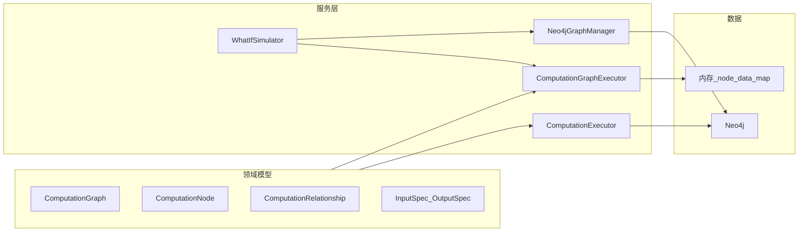

# 项目运作说明（WhatIf2 / Graph What-If Analysis）

## 项目定位

这是一个 **基于计算图（Computation Graph）的 What-If 分析系统**：在由节点和边组成的计算图上，修改输入（如价格、数量），按依赖顺序重算，得到新的派生结果，并可选择将结果写回 Neo4j。

---

## 整体架构

- **领域模型**（[src/domain/models/](src/domain/models/)）：不可变的计算图定义（节点、边、输入/输出规格）。
- **服务层**（[src/domain/services/](src/domain/services/)）：执行器（两种实现）、Neo4j 读写、What-If 模拟入口。
- **数据**：Neo4j 存业务数据与图结构；内存中的 `node_data_map` 在 NetworkX 模式下承载节点数据。

---

## 核心数据模型（简要）

| 概念                          | 说明                                                                                                                    |
| --------------------------- | --------------------------------------------------------------------------------------------------------------------- |
| **ComputationNode**         | 计算节点：`inputs`（InputSpec）、`outputs`（OutputSpec）、`code`（如 `price * quantity`）、`engine`（PYTHON/NEO4J/EXTERNAL）。          |
| **ComputationRelationship** | 边：类型为 `DEPENDS_ON`（数据/上游输出 → 计算节点）或 `OUTPUT_TO`（计算节点 → 数据节点属性）。                                                       |
| **ComputationGraph**        | 不可变图：包含所有 ComputationNode 和 ComputationRelationship，提供 `add_computation_node` / `add_computation_relationship` 等构建方法。 |
| **InputSpec / OutputSpec**  | 规定数据来源/去向：如 `InputSpec("property", "Product", "price")`、`OutputSpec("property", "Product", "total_output")`。          |

同一业务节点（如 Product）可同时通过多条边连接多个计算节点（不同属性），即「多关系」示例 [examples/multi_relation_demo.py](examples/multi_relation_demo.py) 所演示的 DEPENDS_ON + OUTPUT_TO 组合。

---

## 两种执行路径

项目里存在 **两条执行路径**，对应示例中的两种 Demo 模式：

### 路径 1：ComputationExecutor（Neo4j 全流程）

- **入口**：[ComputationExecutor](src/domain/services/computation_executor.py)（async），通过 [DataProvider](src/domain/services/computation_executor.py)（如 Neo4jDataProvider）从 Neo4j 读节点数据。
- **流程**：根据 `ComputationGraph` 与起始数据节点 ID，按依赖解析并执行每个 ComputationNode；从 DataProvider 取输入、执行 `code`（如 Python `eval`），写回通过 DataProvider 的 `set_node_properties` 可落库。
- **示例用法**：`multi_relation_demo.py` 中的 `demo_with_real_neo4j()`：创建 Product/ComputationNode/Relationship 到 Neo4j → 用 `ComputationExecutor.execute_and_write_back(graph, start_node_id)` 执行并写回。

### 路径 2：ComputationGraphExecutor + NetworkX（内存图 + 可选 Neo4j 读写）

- **入口**：[ComputationGraphExecutor](src/domain/services/computation_graph_executor.py)，接收 `ComputationGraph` 和内存中的 `node_data_map`。
- **流程**：将计算图转为 NetworkX 有向图（数据节点 + 计算节点 + DEPENDS_ON/OUTPUT_TO 边），用 **拓扑排序** 得到执行顺序；逐节点从 predecessor 聚合变量、`eval(code)`，再通过 OUTPUT_TO 边把结果写回后继节点（通常是数据节点的属性）。
- **What-If**：[WhatIfSimulator](src/domain/services/what_if_simulator.py) 基于 `ComputationGraphExecutor`：先 `update_node_property` 改输入，再 `execute()` 重算，可选通过 [Neo4jGraphManager](src/domain/services/neo4j_graph_manager.py) 的 `write_output_properties` 写回 Neo4j。
- **示例用法**：`multi_relation_demo.py` 中的 `demo_with_networkx()`：从 Neo4j 读 Product 数据 → 用 `build_networkx_graph` + `execute_networkx_graph` 在内存中执行；What-If 段直接改 `G.nodes[PRODUCT_NODE_ID]["price"]` 等再重跑。

两条路径都遵循「按 DEPENDS_ON 拓扑序执行、OUTPUT_TO 写回结果」的同一套计算图语义，只是数据来源和写回方式不同（Neo4j 全程 vs 内存 + 可选写回）。

---

## 示例：multi_relation_demo 中的计算链

- **数据节点**：`product_001`（Product），属性包括 `price`, `quantity`, `discount_rate`, `tax_rate` 等。
- **计算节点**：
  - `calc_total`：`price * quantity` → `total_output`
  - `calc_discount`：`total_output * (1 - discount_rate)` → `price_after_discount`
  - `calc_tax`：`price_after_discount * (1 + tax_rate)` → `final_price`
- **关系**：Product 与各计算节点之间通过 DEPENDS_ON（输入）和 OUTPUT_TO（输出）连接，形成一条链；同一 Product 节点对应多条边、多个属性。
- **运行方式**：`main()` 默认跑「Both」：先 `demo_with_real_neo4j()`（路径 1），再 `demo_with_networkx()`（路径 2 + What-If 价格/数量变化）。

---

## 关键文件索引

- **模型与设计说明**：[src/domain/models/README_COMPUTATION_GRAPH.md](src/domain/models/README_COMPUTATION_GRAPH.md)（中文版：`README_COMPUTATION_GRAPH_CN.md`）
- **图模型**：`computation_graph.py`、`computation_node.py`、`computation_relationship.py`、`io_spec.py`
- **执行**：`computation_executor.py`（Neo4j 路径）、`computation_graph_executor.py`（NetworkX 路径）
- **Neo4j 与 What-If**：`neo4j_graph_manager.py`、`what_if_simulator.py`
- **示例**：[examples/multi_relation_demo.py](examples/multi_relation_demo.py)、`simple_computation_chain.py`、`networkx_demo.py`

---

## 小结

项目通过 **不可变计算图模型** 描述「谁依赖谁、输入输出是什么、用什么表达式」；**两条执行路径** 分别面向「Neo4j 全流程」和「内存图 + 可选 Neo4j 写回」，共用同一套图语义；**What-If** 即改输入 → 按拓扑序重算 → 可选写回 Neo4j。多关系 Demo 展示了同一数据节点通过多种边类型连接多个计算节点的用法。